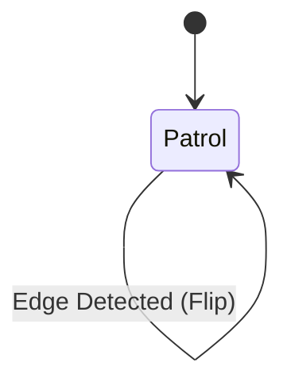
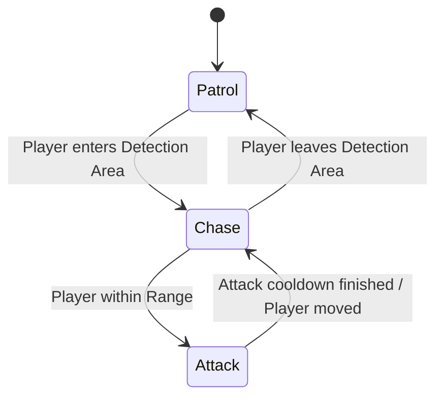

# 👾 Mob Design & Mechanics Documentation

This document outlines the behavior and implementation details for the different types of mobs in **Lac Than Game**.

---

## 1. Ground Patrol Mobs (Quái Sâu & Ốc)

These mobs are basic ground enemies that strictly follow a patrol path. They are designed to add environmental hazards without actively pursuing the player.

### Visuals
| Mob Type | Asset Path | Preview |
| :--- | :--- | :--- |
| **Quái Sâu (Worm)** | `assets/enemy/Frame 1.png` |  |
| **Ốc (Snail)** | `assets/enemy/image 1.png` |  |

### Behavior Logic
- **Movement**: Walks back and forth between two points.
- **Edge/Wall Detection**: Uses `RayCast2D` to detect:
    - **Walls**: If the ray hits a wall, the mob flips direction.
    - **Ledges**: If a downward-pointing ray stops colliding with the floor, the mob flips direction to avoid falling.
- **State Machine**: 
    - **PATROL**: The only active state.

### State Machine Diagram


### Implementation Tips
```gdscript
# Detection Logic
if is_on_wall() or not ledge_check_ray.is_colliding():
    direction *= -1
    sprite.flip_h = direction < 0
```

---

## 2. Aggressive Mobs (Quái Bọ)

The Beetle is a more complex enemy that can detect the player and transition into an aggressive state.

### Visuals
| Mob Type | Asset Path | Preview |
| :--- | :--- | :--- |
| **Quái Bọ (Beetle)** | `assets/enemy/Frame 8.png` |  |

### Behavior Logic
- **Detection**: Uses an `Area2D` (DetectionZone) to sense the player.
- **States**:
    1.  **PATROL**: Standard movement (same as Worm/Snail).
    2.  **CHASE**: When the player enters the `Area2D`, the beetle speeds up and moves toward the player's X position.
    3.  **ATTACK**: When within range, the beetle stops and shoots a projectile (ball).

### State Machine Diagram


### Key Components
- **Area2D (DetectionZone)**: For switching from Patrol to Chase.
- **Timer (AttackTimer)**: To control the frequency of shooting.
- **Projectile (Ball)**: A separate scene that moves linearly in the direction of the player.

---

## Technical Implementation Notes

### Node Structure for Beetle
- `CharacterBody2D` (Root)
    - `Sprite2D`
    - `CollisionShape2D`
    - `RayCast2D` (For edge/wall detection)
    - `Area2D` (Detection Area)
        - `CollisionShape2D` (Circle or Rectangle)
    - `Marker2D` (Spawn point for projectiles)
    - `Timer` (Attack Cooldown)
    - `AnimationPlayer`

### Recommended State Code
```gdscript
enum State { PATROL, CHASE, ATTACK }
var current_state = State.PATROL

func _physics_process(delta):
    match current_state:
        State.PATROL:
            _handle_patrol()
        State.CHASE:
            _handle_chase()
        State.ATTACK:
            _handle_attack()
```
